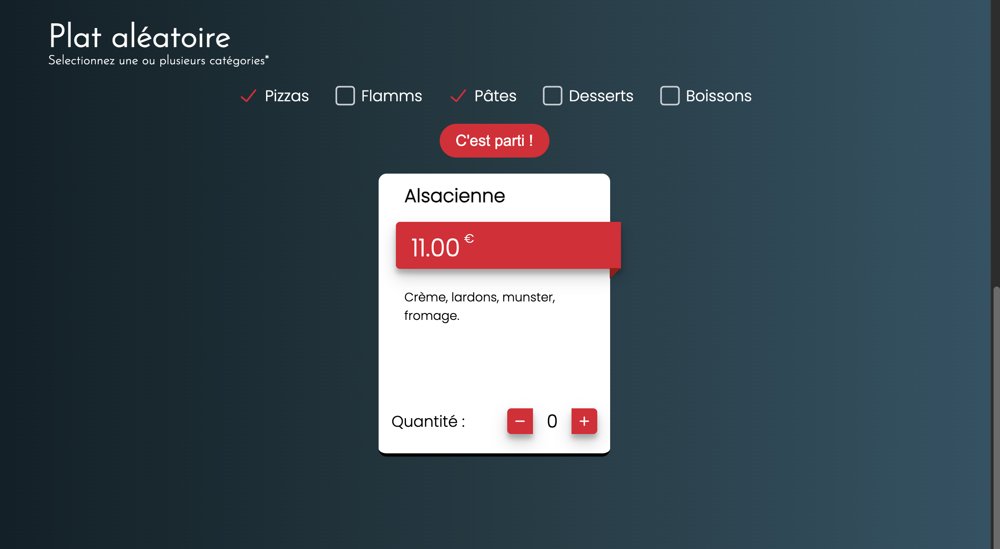
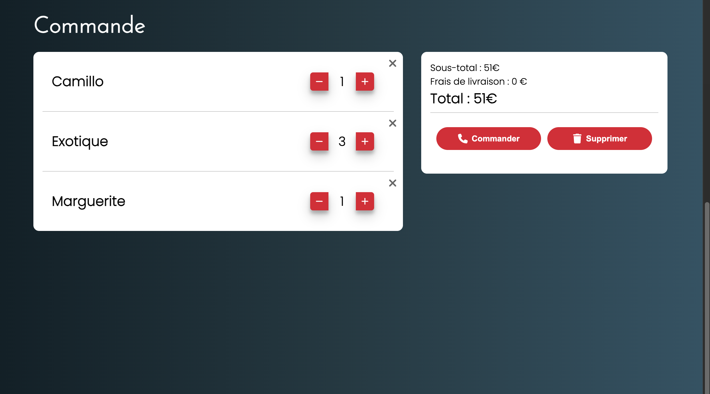
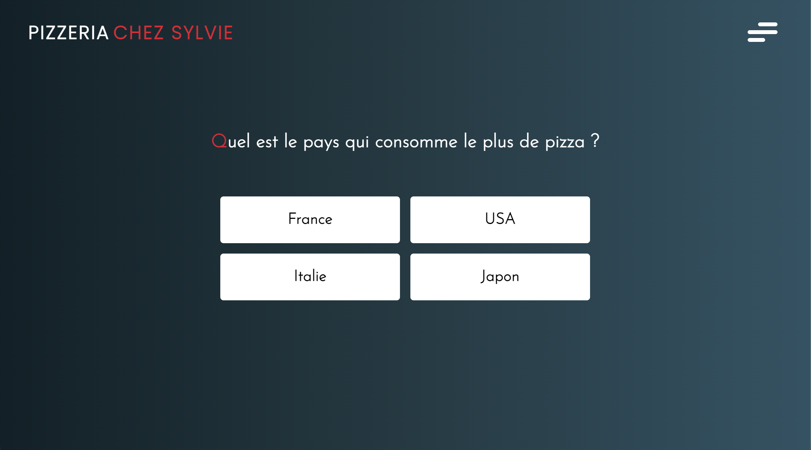

# Chez Sylvie - Website

Interactive restaurant website for a local pizzeria, built with React + TypeScript + Vite.

Product goal: deliver a fast and modern experience to browse the menu, build an order, discover a random dish, and improve engagement with an interactive quiz.

<p align="center">
  
  <br>
  <em>Preview of the website's home page</em>
</p>

## Demo

- Local URL: http://localhost:5173
- Production build powered by Vite

## Key Features

- Smooth multi-page navigation with React Router
- Menu browsing by category (pizzas, flamms, pasta, kids, desserts, drinks)
- Random dish picker with multi-category selection
- Local cart with quantity updates, item deletion, and total calculation
- Cart persistence using LocalStorage
- Interactive quiz with random questions and final score
- First-visit informational popup
- Full contact page (Google Maps, phone, Facebook, opening hours, payments)
- Legal notice page and custom 404 page

<p align="center">
  
  <br>
  <em>Preview of the website's random dish feature</em>
</p>
<br>
<p align="center">
  
  <br>
  <em>Preview of the website's order feature</em>
</p>
<br>
<p align="center">
  
  <br>
  <em>Preview of the website's quiz feature</em>
</p>

## Tech Stack

- React 18
- TypeScript
- Vite
- React Router DOM
- Font Awesome
- AOS (scroll animations)
- @uiball/loaders
- UUID

## Project Architecture

The codebase is organized by UI and business domains:

- src/components: visual components (Home, DishList, Quiz, Contact, NavBar, etc.)
- src/providers: global state with Context + useReducer
- src/reducers/CommonReducer.ts: shared reducer logic
- src/helpers: utility layer (settings, data fetch, filters)
- public/data/data.json: local data source (images, dishes, quiz)

## State Management

- AppContextProvider: pathname, navbar state, popup behavior, carousel state
- DishContextProvider: dish categories, filtering, random picker, cart state, alert popup
- QuizContextProvider: quiz launch, progression, answers, scoring, reset

## Data Layer

Data is centralized in a local JSON file:

- images: seasonal carousel assets
- dishes: catalog with names, descriptions, and prices
- quiz: question and answer sets

Data retrieval is handled with fetch and filtered by domain type via helpers.

## UX/UI Highlights

- Animated SVG hamburger menu for mobile navigation
- Parallax header on home and menu pages
- AOS-driven section reveal animations
- Responsive layout focused on conversion and quick menu access

## Expected KPIs

This section is useful for freelance positioning and client discussions.

- +20% to +40% increase in menu page views after launch
- +15% to +30% increase in click-to-call actions from the order flow
- +10% to +25% increase in average session duration (better interaction depth)
- +20% to +35% return-visitor rate with quiz and random dish engagement
- <2.5s median page load on mobile (good perceived performance target)

Tracking suggestions:

- CTA click rate on "See Menu"
- Cart interaction rate (add/remove/update quantity)
- Click-to-call conversion rate
- Quiz start rate and completion rate
- Contact page visit-to-action ratio

## Installation

> 💡 **Note:** Project developed using Yarn. You can use either npm or yarn to run it locally.

Requirements:

- Node.js 18+
- npm or yarn

Commands (npm):

```bash
npm install
npm run dev
```

Commands (yarn):

```bash
yarn
yarn dev
```

## Available Scripts

With npm:

```bash
npm run dev      # start Vite dev server
npm run build    # compile TypeScript and build for production
npm run preview  # preview production build locally
```

With yarn:

```bash
yarn dev         # start Vite dev server
yarn build       # compile TypeScript and build for production
yarn preview     # preview production build locally
```

## Project Structure

```text
.
|- public/
|  |- assets/
|  |- data/
|     |- data.json
|- src/
|  |- components/
|  |- helpers/
|  |- interfaces/
|  |- providers/
|  |- reducers/
|  |- Router/
|  |- App.tsx
|  |- main.tsx
|  |- index.css
|- package.json
|- tsconfig.json
|- vite.config.ts
```

## Improvement Roadmap

- Add a backend API for menu and order management
- Add unit tests (helpers/reducers) and integration tests (cart/quiz flows)
- Add analytics dashboard for product and conversion KPIs
- Add i18n (FR/EN) for wider audience reach

## Freelance Positioning (Malt / Fiverr)

This project demonstrates:

- Ability to deliver a complete business-oriented frontend
- Clean, modular, and maintainable architecture
- Product thinking with conversion-oriented UX choices
- End-to-end implementation from routing to state and data flow

## Author

Pascal Hector (Akaï)

Freelance Web & Mobile Developer (TypeScript) | React & React Native / Expo / Cordova

This repository is shared as a project showcase for client discussions on freelance platforms.